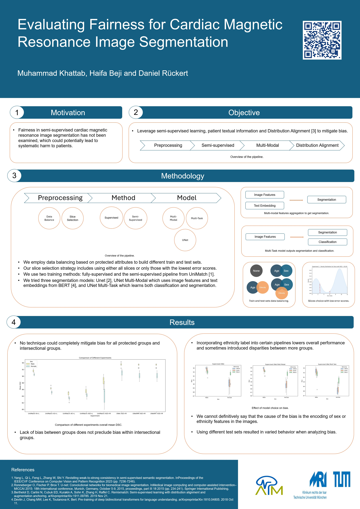

# Evaluating Fairness for Semi-supervised Cardiac Magnetic Resonance Image Segmenation

## The Project

- Documents for poster, slides, thesis, and main results are available in the [docs](./docs/) and all of the results are in the corresponding notebooks.
- Code for the UKBB usecase is avialable in [more-scenarios](./more-scenarios/medical/)
- Project setup for UKBB usecase is in this [readme](./more-scenarios/medical/README.md)



## Motivation

In healthcare, the workload is always increasing, and the workforce is limited, which calls for automation of certain tasks to save time. An example showcasing this idea is Rwanda, where in 2015, there were only 11 radiologists available for a population of 12 million [62]. Fairness is a major concern in in healthcare, where the models are used to make decisions that affect human lives.

## Objective

We would like to leverage semi-supervised learning, patient textual information and Distribution Alignment [3] to mitigate bias. Using semi-supervised helps with scarcity of data in low-data regimes and provides a means of representation learning which could offer help with bias mitigation.

## Methodology

We employ a three-stage pipeline where we employ a number of techniques. For the preprocessing step we have data balanacing and slice selection. We employ data balancing based on protected attributes to build different train and test sets.
Our slice selection strategy includes using either all slices or only those with the lowest error scores.

The second stage is method choice where we use two training methods: fully-supervised and the semi-supervised pipeline from UniMatch [1].

The third stage is the model choice where we tried three segmentation models: Unet [2], UNet Multi-Modal which uses image features and text embeddings from BERT [4], and UNet Multi-Task which learns both classification and segmentation.

## Results

- No technique could completely mitigate bias for all protected groups and intersectional groups.
- Lack of bias between groups does not preclude bias within intersectional groups.
- Incorporating ethnicity label into certain pipelines lowers overall performance and sometimes introduced disparities between more groups.
- We cannot definitively say that the cause of the bias is the encoding of sex or ethnicity features in the images.
- Using different test sets resulted in varied behavior when analyzing bias.

# UniMatch

[](https://paperswithcode.com/sota/semi-supervised-semantic-segmentation-on-21?p=revisiting-weak-to-strong-consistency-in-semi)
[](https://paperswithcode.com/sota/semi-supervised-semantic-segmentation-on-4?p=revisiting-weak-to-strong-consistency-in-semi)
[](https://paperswithcode.com/sota/semi-supervised-semantic-segmentation-on-27?p=revisiting-weak-to-strong-consistency-in-semi)
[](https://paperswithcode.com/sota/semi-supervised-semantic-segmentation-on-29?p=revisiting-weak-to-strong-consistency-in-semi)
[](https://paperswithcode.com/sota/semi-supervised-semantic-segmentation-on-10?p=revisiting-weak-to-strong-consistency-in-semi)
[](https://paperswithcode.com/sota/semi-supervised-semantic-segmentation-on-22?p=revisiting-weak-to-strong-consistency-in-semi)
[](https://paperswithcode.com/sota/semi-supervised-semantic-segmentation-on-2?p=revisiting-weak-to-strong-consistency-in-semi)
[](https://paperswithcode.com/sota/semi-supervised-semantic-segmentation-on-1?p=revisiting-weak-to-strong-consistency-in-semi)

This codebase contains a strong re-implementation of FixMatch in the field of semi-supervised semantic segmentation, as well as the official PyTorch implementation of our UniMatch in the **[natural](https://github.com/LiheYoung/UniMatch), [remote sensing](https://github.com/LiheYoung/UniMatch/tree/main/more-scenarios/remote-sensing), and [medical](https://github.com/LiheYoung/UniMatch/tree/main/more-scenarios/medical) scenarios**.

> **[Revisiting Weak-to-Strong Consistency in Semi-Supervised Semantic Segmentation](https://arxiv.org/abs/2208.09910)**</br>
> Lihe Yang, Lei Qi, Litong Feng, Wayne Zhang, Yinghuan Shi</br>
> *In Conference on Computer Vision and Pattern Recognition (CVPR), 2023*


**We provide a list of [Awesome Semi-Supervised Semantic Segmentation](./docs/SemiSeg.md) works.**

<p align="left">

</p>

## Results

**You can check our [training logs](https://github.com/LiheYoung/UniMatch/blob/main/training-logs) for convenient comparisons during reproducing.**

**Note: we have added and updated some results in our camera-ready version. Please refer to our [latest version](https://arxiv.org/abs/2208.09910)**.

### Pascal VOC 2012

Labeled images are sampled from the **original high-quality** training set. Results are obtained by DeepLabv3+ based on ResNet-101 with training size 321.

| Method                      | 1/16 (92) | 1/8 (183) | 1/4 (366) | 1/2 (732) | Full (1464) |
| :-------------------------: | :-------: | :-------: | :-------: | :-------: | :---------: |
| SupBaseline                 | 45.1      | 55.3      | 64.8      | 69.7      | 73.5        |
| U<sup>2</sup>PL             | 68.0      | 69.2      | 73.7      | 76.2      | 79.5        |
| ST++                        | 65.2      | 71.0      | 74.6      | 77.3      | 79.1        |
| PS-MT                       | 65.8      | 69.6      | 76.6      | 78.4      | 80.0        |
| **UniMatch (Ours)**         | **75.2**  | **77.2**  | **78.8**  | **79.9**  | **81.2**    |


### Cityscapes

Results are obtained by DeepLabv3+ based on ResNet-50/101. We reproduce U<sup>2</sup>PL results on ResNet-50.

**Note: the results differ from our arXiv-V1 because we change the confidence threshold from 0.95 to 0, and change the ResNet output stride from 8 to 16. Therefore, it is currently more efficient to run.**

*You can click on the numbers to be directed to corresponding checkpoints.*

| ResNet-50                   | 1/16      | 1/8       | 1/4       | 1/2       | ResNet-101           | 1/16        | 1/8         | 1/4         | 1/2         |
| :-------------------------: | :-------: | :-------: | :-------: | :-------: | :------------------: | :---------: | :---------: | :---------: | :---------: |
| SupBaseline                 | 63.3      | 70.2      | 73.1      | 76.6      | SupBaseline          | 66.3        | 72.8        | 75.0        | 78.0        |
| U<sup>2</sup>PL             | 70.6      | 73.0      | 76.3      | 77.2      | U<sup>2</sup>PL      | 74.9        | 76.5        | 78.5        | 79.1        |
| **UniMatch (Ours)**         | [**75.0**](https://drive.google.com/file/d/1J-GjeZRhIhnbxtD8f_lDflXB24S1E995/view?usp=sharing)  | [**76.8**](https://drive.google.com/file/d/1pA-enIDGWSVyhJg7SFIjFQ-nlxetj6-m/view?usp=sharing)  | [**77.5**](https://drive.google.com/file/d/1EEh8XMljUf40wzMblnv9Ez9_dfXYqO7P/view?usp=sharing)  | [**78.6**](https://drive.google.com/file/d/18Bd43RsXhTw9RL3F9Vn9lz_Gs5KQWaTE/view?usp=sharing)  | **UniMatch (Ours)**  | [**76.6**](https://drive.google.com/file/d/1qmCBLC9aj57kz1_OptvK6YTo4GwxTsiK/view?usp=sharing)    | [**77.9**](https://drive.google.com/file/d/14LrPkWC8QIMO44da5pGflyOrW_Fdxo0U/view?usp=sharing)    | [**79.2**](https://drive.google.com/file/d/1cL-p2_FIwEe9Y4AapSjlLmt4hdAZzX7a/view?usp=sharing)    | [**79.5**](https://drive.google.com/file/d/1ve2BAYoh8wzQxhKD-CE7bsjcR5KqQEa3/view?usp=sharing)    |


### COCO

Results are obtained by DeepLabv3+ based on Xception-65.

*You can click on the numbers to be directed to corresponding checkpoints.*

| Method                      | 1/512 (232) | 1/256 (463) | 1/128 (925) | 1/64 (1849) | 1/32 (3697) |
| :-------------------------: | :---------: | :---------: | :---------: | :---------: | :---------: |
| SupBaseline                 | 22.9        | 28.0        | 33.6        | 37.8        | 42.2        |
| PseudoSeg                   | 29.8        | 37.1        | 39.1        | 41.8        | 43.6        |
| PC<sup>2</sup>Seg           | 29.9        | 37.5        | 40.1        | 43.7        | 46.1        |
| **UniMatch (Ours)**         | [**31.9**](https://drive.google.com/file/d/1kFgg0SGLzS7SJI8sYPQKGLnw8G060kjz/view?usp=sharing)    | [**38.9**](https://drive.google.com/file/d/1scx1FanOcmaut8eVESLaSx7-DiT5JJA6/view?usp=sharing)    | [**44.4**](https://drive.google.com/file/d/1oojVn12tgPW_m94tAOU5YYVZ7xJJitCj/view?usp=sharing)    | [**48.2**](https://drive.google.com/file/d/1tI1AZ8rY6hYQrs216iz2NmlAfLl8f1uP/view?usp=sharing)    | [**49.8**](https://drive.google.com/file/d/1hwRr0IIhdeKH2JYO--iOLl5y69sJ0UYm/view?usp=sharing)    |


### More Scenarios

We also apply our UniMatch in the scenarios of semi-supervised **remote sensing change detection** and **medical image segmentation**, achieving tremendous improvements over previous methods:

- [Remote Sensing Change Detection](https://github.com/LiheYoung/UniMatch/blob/main/more-scenarios/remote-sensing) [[training logs]](https://github.com/LiheYoung/UniMatch/blob/main/more-scenarios/remote-sensing/training-logs)
- [Medical Image Segmentation](https://github.com/LiheYoung/UniMatch/blob/main/more-scenarios/medical) [[training logs]](https://github.com/LiheYoung/UniMatch/blob/main/more-scenarios/medical/training-logs)

## Getting Started

### Installation

```bash
cd UniMatch
conda create -n unimatch python=3.10.4
conda activate unimatch
pip install -r requirements.txt
pip install torch==1.12.1+cu113 torchvision==0.13.1+cu113 -f https://download.pytorch.org/whl/torch_stable.html
```

### Pretrained Backbone

[ResNet-50](https://drive.google.com/file/d/1mqUrqFvTQ0k5QEotk4oiOFyP6B9dVZXS/view?usp=sharing) | [ResNet-101](https://drive.google.com/file/d/1Rx0legsMolCWENpfvE2jUScT3ogalMO8/view?usp=sharing) | [Xception-65](https://drive.google.com/open?id=1_j_mE07tiV24xXOJw4XDze0-a0NAhNVi)

```
├── ./pretrained
    ├── resnet50.pth
    ├── resnet101.pth
    └── xception.pth
```

### Dataset

- Pascal: [JPEGImages](http://host.robots.ox.ac.uk/pascal/VOC/voc2012/VOCtrainval_11-May-2012.tar) | [SegmentationClass](https://drive.google.com/file/d/1ikrDlsai5QSf2GiSUR3f8PZUzyTubcuF/view?usp=sharing)
- Cityscapes: [leftImg8bit](https://www.cityscapes-dataset.com/file-handling/?packageID=3) | [gtFine](https://drive.google.com/file/d/1E_27g9tuHm6baBqcA7jct_jqcGA89QPm/view?usp=sharing)
- COCO: [train2017](http://images.cocodataset.org/zips/train2017.zip) | [val2017](http://images.cocodataset.org/zips/val2017.zip) | [masks](https://drive.google.com/file/d/166xLerzEEIbU7Mt1UGut-3-VN41FMUb1/view?usp=sharing)

Please modify your dataset path in configuration files.

**The groundtruth masks have already been pre-processed by us. You can use them directly.**

```
├── [Your Pascal Path]
    ├── JPEGImages
    └── SegmentationClass
    
├── [Your Cityscapes Path]
    ├── leftImg8bit
    └── gtFine
    
├── [Your COCO Path]
    ├── train2017
    ├── val2017
    └── masks
```

## Usage

### UniMatch

```bash
# use torch.distributed.launch
sh scripts/train.sh <num_gpu> <port>
# to fully reproduce our results, the <num_gpu> should be set as 4 on all three datasets
# otherwise, you need to adjust the learning rate accordingly

# or use slurm
# sh scripts/slurm_train.sh <num_gpu> <port> <partition>
```

To train on other datasets or splits, please modify
``dataset`` and ``split`` in [train.sh](https://github.com/LiheYoung/UniMatch/blob/main/scripts/train.sh).

### FixMatch

Modify the ``method`` from ``'unimatch'`` to ``'fixmatch'`` in [train.sh](https://github.com/LiheYoung/UniMatch/blob/main/scripts/train.sh).

### Supervised Baseline

Modify the ``method`` from ``'unimatch'`` to ``'supervised'`` in [train.sh](https://github.com/LiheYoung/UniMatch/blob/main/scripts/train.sh), and double the ``batch_size`` in configuration file if you use the same number of GPUs as semi-supervised setting (no need to change ``lr``). 


## Citation

If you find this project useful, please consider citing:

```bibtex
@inproceedings{unimatch,
  title={Revisiting Weak-to-Strong Consistency in Semi-Supervised Semantic Segmentation},
  author={Yang, Lihe and Qi, Lei and Feng, Litong and Zhang, Wayne and Shi, Yinghuan},
  booktitle={CVPR},
  year={2023}
}
```

We have some other works on semi-supervised semantic segmentation:

- [[CVPR 2022] ST++](https://github.com/LiheYoung/ST-PlusPlus) 
- [[CVPR 2023] AugSeg](https://github.com/ZhenZHAO/AugSeg)
- [[CVPR 2023] iMAS](https://github.com/ZhenZHAO/iMAS)
